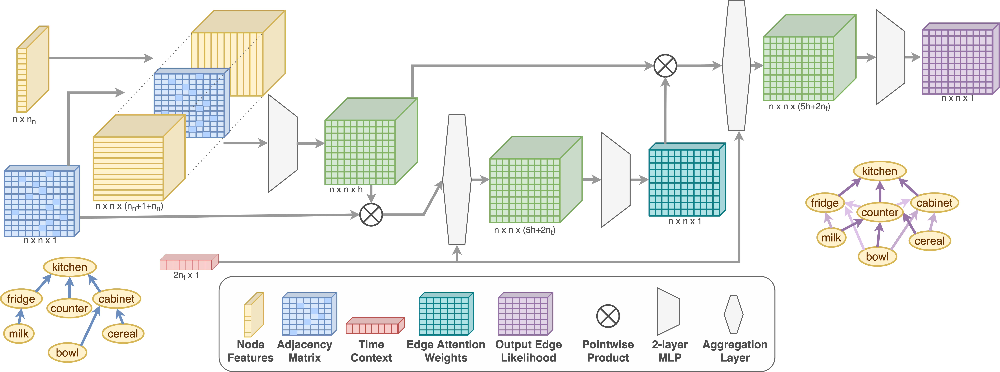

# SpatioTemporalObjectTracking
Graph translation network for modeling spatio-temporal dynamics of household objects for our paper 'Proactive Robot Assistance via Spatio-Temporal Object Modeling'. The model reads in an input graph representing the environment and time, and translates it to a probabilistic output graph representing the environment at the next time step. It uses the HOMER dataset which can be found [here](https://github.com/GT-RAIL/rail_tasksim/tree/homer/routines).



### Running this model
To run the model on the existing dataset, you can use the `run.py` with the path to the dataset and config file. e.g. `python3 ./run.py --path=$dataset`. To run a batch using existing configuration with baselines and ablations, use `runRoutines.sh`. 

Some common things to do are:
- Running the model as is on a dataset
     `python3 ./run.py --path=$dataset --name=ours --train_days=$train_days --logs_dir=$logs_dir/$train_days --write_ckpt`
- Running the baselines on a dataset
     `python3 ./run.py --cfg=default --path=$dataset --baselines --train_days=$train_days --logs_dir=$logs_dir/$train_days`
- Pretrain a model on a combination of datasets
     `python3 ./run_pt.py --path=$d_target --pretrain_dirs=$d0,$d1,$d2,$d3,$d4 --name=ourspt --train_days=$logs_dir/$train_days --logs_dir=$logs_dir/$train_days --write_ckpt`
- Finetune a pretrained model
     `python3 ./run.py --path=$d_target --name=ourspt --train_days=$train_days --logs_dir=$logs_dir/$train_days --write_ckpt --finetune --ckpt_dir=$ckpt_root/0/$target/ourspt`
- Run ablations or other configurations
     `python3 ./run.py --cfg=$myNewConfig --path=$dataset --name=$myNewConfig --train_days=30 --logs_dir=$logs_dir/$train_days --write_ckpt`


A processed version of the [HOMER dataset](https://github.com/GT-RAIL/rail_tasksim/tree/homer/routines) used for the results is present in the `data/` directory of this repository, and can be used directly with the model using the above commands. In order to use a different dataset generated using HOMER, first copy the dataset into `data/` directory, and then run `prepRoutines.sh` to run the necessary pre-processing. This needs to be done only once.

If you're curious about the code itself:
- The model and it's helper functions can be found in `GraphTranslatorModule.py`
- The `reader.py` file contains code to process the (HOMER) dataset
- The evaluation functions for our model are in `breakdown_evaluations.py`

### Citation
```
Anonymous
```
